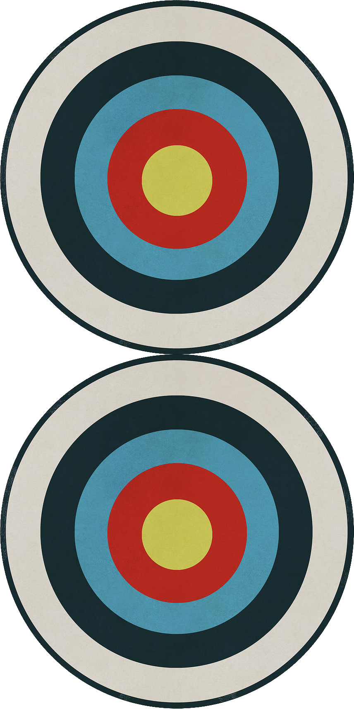
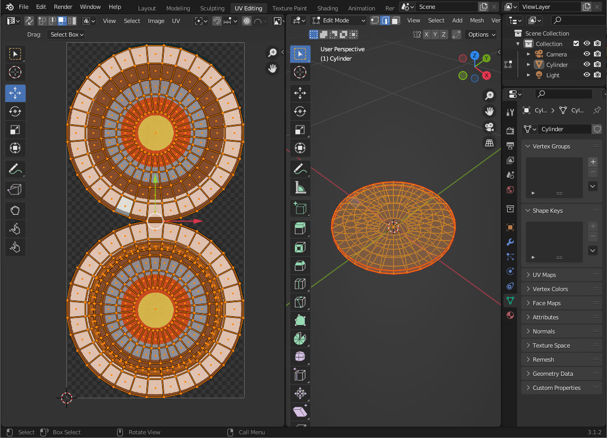
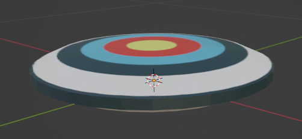

### My Way to Learn Unreal Engine
1. Learn GIMP because I need a photo editor to create the texture.  
From this original picture 
</img>  
to this texture (I can use it in blender).  
</img>  
2. Learn 3D modeling in Blender ([how to model](https://www.youtube.com/watch?v=nIoXOplUvAw), [how to UV unwrap](https://www.youtube.com/watch?v=7a0cHFs7jkw)) because Unreal Engine is not for static mesh creation. 
This is the UV mapping. 
</img>   
This is the result. 
</img>    
3. Learn Unreal 
3.1 Begin with blueprint scripting ([how to create a game scene](https://www.youtube.com/watch?v=gQmiqmxJMtA), [how to create a shooting game](https://www.youtube.com/watch?v=ITCWa3oLNAQ)). 
3.2 Play a VR game ([how to setup Oculus Quest 2](https://www.youtube.com/watch?v=Nqg3qlJdCCM)).