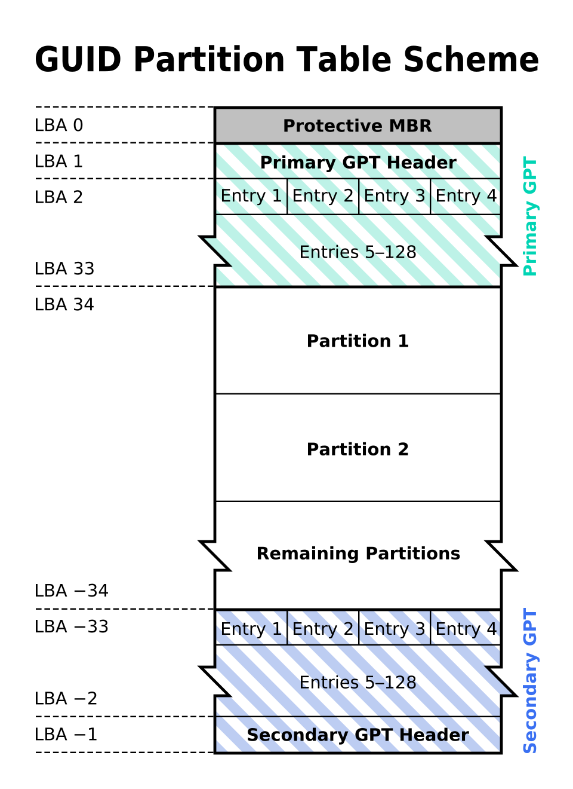

# Partition table manipulator for Linux

## Try to backup a disk using least space and move the data to a bigger disk

* Let's talk about GPT scheme first.
</br> </img>
* If we are going to clone a disk, we need copy LBA 0, LBA 1~33, LBA 34+.
* We are going to use dd to copy LBA 0 and LBA34+ and we are going to use sfdisk to write LBA 1~33.

### Action
1. Save partition table of the smaller disk (/dev/sda). Actually, we are learning info from LBA 1~33.

```sh
$ sudo su
# sfdisk -d /dev/sda > sda.gpt.sfdisk
```

2. What does the partition table (.sfdisk file) look like

```sh
# cat sda.gpt.sfdisk

label: gpt
label-id: FB14F3DC-E048-41DF-B98C-D15A3ED8F89B
device: /dev/sda
unit: sectors
first-lba: 34
last-lba: 12_582_878
sector-size: 512

/dev/sda1 : start=        2048, size=       2_048, type=21686148-6449-6E6F-744E-656564454649 (B)
/dev/sda2 : start=        4096, size=   9_375_744, type=0FC63DAF-8483-4772-8E79-3D69D8477DE4 (L)
```

* Type in GPT

| 用途                 | GUID                                   | 简写        |
| -------------------- | -------------------------------------- | ---------- |
| EFI System Partition | `C12A7328-F81F-11D2-BA4B-00A0C93EC93B` | U          |
| Microsoft Basic Data | `EBD0A0A2-B9E5-4433-87C0-68B6B72699C7` | M          |
| Linux filesystem     | `0FC63DAF-8483-4772-8E79-3D69D8477DE4` | L          |
| Linux swap           | `0657FD6D-A4AB-43C4-84E5-0933C84B4F4F` | S          |
| BIOS Boot Partition  | `21686148-6449-6E6F-744E-656564454649` | B          |

3. Save LBA 0 and partitions separately. Acutally, we are storing LBA 0, LBA 34 and beyond. We are saving LBA0 because we are using GPT together with Legacy BIOS (we will talk about this later). 

```sh
# dd if=/dev/sda  of=/dev/sdb bs=512 count=1   
# dd if=/dev/sda1 of=sda1.img bs=64K status=progress
# dd if=/dev/sda2 of=sda2.img bs=64K status=progress
```

4. See, the new disk (on another machine) is bigger (10_485_760 sectors * 512 Bytes/sector == 5GB)

```sh
# fdisk -l /dev/sdb

Disk /dev/sdb: 5 GiB, 5_368_709_120 bytes, 10_485_760 sectors
Disk model: VBOX HARDDISK   
Units: sectors of 1 * 512 = 512 bytes
Sector size (logical/physical): 512 bytes / 512 bytes
I/O size (minimum/optimal): 512 bytes / 512 bytes 
```

5. Give the new disk a new GPT with wanted partition. In fact, we are manipulating LBA 1~33 on the new disk.

```sh
cat << ABC > clone.sh
sfdisk /dev/sda << EOF
label: gpt
unit: sectors
sector-size: 512

start=2048, size=2048, type=B
start=    , size=+   , type=L
EOF
ABC
```

6. Write data to the new partition

```sh
sudo sfdisk /dev/sdY < partition_table.sfdisk
sudo dd if=sdX1.img of=/dev/sdY1 bs=64K status=progress
```

## A workable scheme

* old

```txt
label: gpt
label-id: 0752B0D6-4DC7-4F89-8504-E8339C5DB9EE
device: /dev/sda
unit: sectors
first-lba: 34
last-lba: 976773134
sector-size: 512

/dev/sda1 : start=        2048, size=      409600, type=C12A7328-F81F-11D2-BA4B-00A0C93EC93B, uuid=4CC7245A-72CF-4C33-B119-A6C742BFDFC3, name="Basic data partition", attrs="GUID:63"
/dev/sda2 : start=      411648, size=       32768, type=E3C9E316-0B5C-4DB8-817D-F92DF00215AE, uuid=421A003B-55CA-49C4-8E18-A9150919CC1F, name="Microsoft reserved partition", attrs="GUID:63"
/dev/sda3 : start=      444416, size=    75776000, type=EBD0A0A2-B9E5-4433-87C0-68B6B72699C7, uuid=1F680F64-ABAB-459C-9415-D80644FC4283, name="Basic data partition"
/dev/sda4 : start=   975128576, size=     1642496, type=DE94BBA4-06D1-4D40-A16A-BFD50179D6AC, uuid=6EDD3F88-E6EE-4CDB-B6CB-95B8961BE6C8, attrs="RequiredPartition GUID:63"
```

* new 
```txt
label: gpt
unit: sectors
sector-size: 512

/dev/sdb1 : start=        2048, size=      409600, type=C12A7328-F81F-11D2-BA4B-00A0C93EC93B, name="Basic data partition", attrs="GUID:63"
/dev/sdb2 : start=      411648, size=       32768, type=E3C9E316-0B5C-4DB8-817D-F92DF00215AE, name="Microsoft reserved partition", attrs="GUID:63"
/dev/sdb4 : start=   975128576, size=     1642496, type=DE94BBA4-06D1-4D40-A16A-BFD50179D6AC, attrs="RequiredPartition GUID:63"
/dev/sdb3 : start=      444416, size=+           , type=EBD0A0A2-B9E5-4433-87C0-68B6B72699C7, name="Basic data partition"
```

* dd

```sh
sfdisk /dev/sdb < sda.sfdisk

dd if=/dev/sda  of=/dev/sdb bs=512 count=1

for i in 1 2 3 4; do dd if=/dev/sda$i of=/dev/sdb$i bs=1M status=progress ;done
```
* We must switch the sequence of sda3 and sda4 or we will get the error 

```sh
Sector xxxxxx already used.
Failed to add #3 partition: Numerical result out of range
```

* Misc

```sh
dd of=protective_mbr     if=/dev/sda bs=512 count=1
dd of=primary_gpt_header if=/dev/sda bs=512 count=33 skip=1
for i in 1 2 3 4; do dd if=/dev/sda$i of=sda$i.dd bs=1M status=progress ; done

dd if=primary_gpt_header of=/dev/sda bs=512 count=33 seek=1
dd if=protective_mbr of=/dev/sda bs=512 count=1
for i in 1 2 3 4; do dd if=sda$i.dd of=/dev/sda$i bs=1M status=progress ; done

parted /dev/${SDX} print free
parted /dev/${SDX} --script resizepart 3 100%
sleep 3
e2fsck -f /dev/${SDX}3
resize2fs /dev/${SDX}3
```