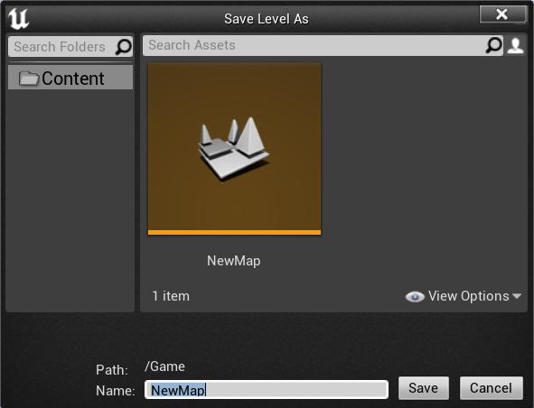
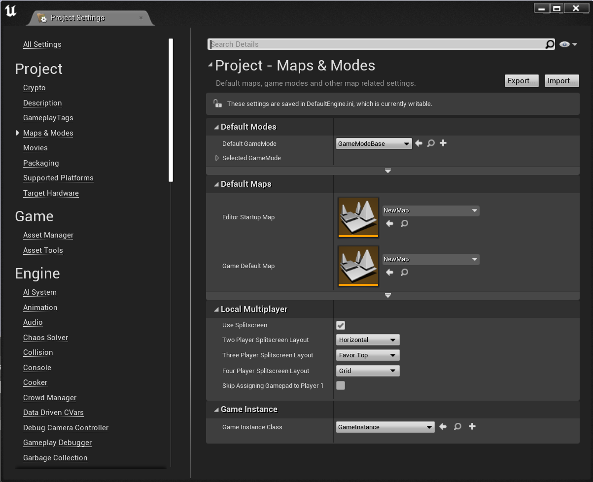
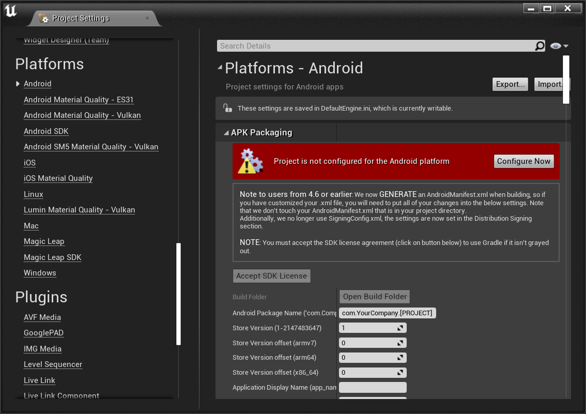
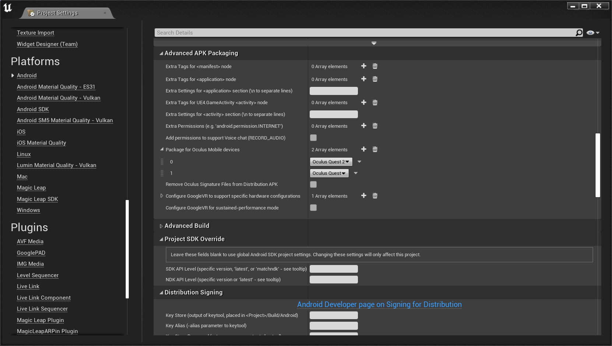
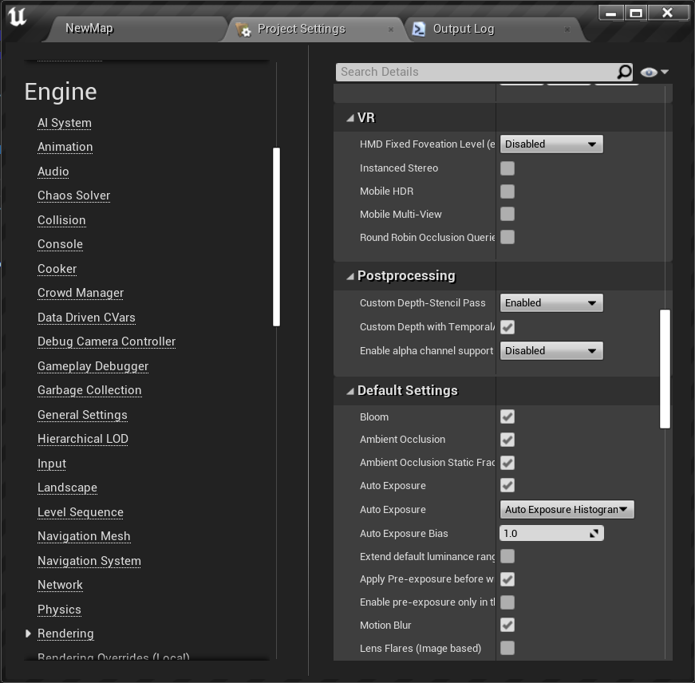

Before you try the C++ Hello World, I recommend this introduction [video](https://www.youtube.com/watch?v=p5Rp500kbOc) for knowing what C++ Programming is in the Unreal Engine.
## C++ Hello World
* Goal: Create a VR Game and install it to our Meta Quest 2
* Checkout this GitHub [repo](https://github.com/xg590/UE4_helloWorld) so you can play it before learn.
### A Minimalistic Game with Unreal Engine 4.27
1. Create a blank C++ Game project (name it as "helloWorld") with no Starter Content.<br />
</img>
2. We get an empty world (called "map" or "level" in UE) with floor and player start.<br />
</img> 
3. You can preview the world right now.
4. Create a new C++ class called "MyCharacter" which inherits the "Character" Class.
5. Edit MyCharacter.h and MyCharacter.cpp (My Project name is "helloWorld" be careful about HELLOWORLD_API, and do not forget build solution in Visual Studio) 

* MyCharacter.h 
```cpp
#pragma once

#include "CoreMinimal.h"
#include "GameFramework/Character.h"
#include "MyCharacter.generated.h"

class UInputComponent;
class UCameraComponent;

UCLASS()
class HELLOWORLD_API AMyCharacter : public ACharacter
{
	GENERATED_BODY()
		UPROPERTY(VisibleAnywhere) UCameraComponent* Camera;

public:
	AMyCharacter();

protected:
	virtual void BeginPlay() override;

public:
	virtual void SetupPlayerInputComponent(class UInputComponent* PlayerInputComponent) override;
};
```
* MyCharacter.cpp 
```cpp
#include "MyCharacter.h"
#include "Camera/CameraComponent.h"
#include "Components/CapsuleComponent.h"
#include "Components/InputComponent.h" 

AMyCharacter::AMyCharacter()
{
	this->bUseControllerRotationPitch = true;
	this->bUseControllerRotationYaw = true;
	this->AutoPossessPlayer = EAutoReceiveInput::Player0;
	this->AutoReceiveInput = EAutoReceiveInput::Player0;
	Camera = CreateDefaultSubobject<UCameraComponent>(TEXT("FirstPersonCamera"));
	Camera->SetupAttachment(GetCapsuleComponent());
	Camera->bUsePawnControlRotation = false;
}

void AMyCharacter::BeginPlay()
{
	Super::BeginPlay();
}

void AMyCharacter::SetupPlayerInputComponent(UInputComponent* PlayerInputComponent)
{
	Super::SetupPlayerInputComponent(PlayerInputComponent);
	PlayerInputComponent->BindAction("Jump", IE_Pressed, this, &ACharacter::Jump);
	PlayerInputComponent->BindAxis("Turn", this, &APawn::AddControllerYawInput);
	PlayerInputComponent->BindAxis("LookUp", this, &APawn::AddControllerPitchInput);
}
```
6. In project settings->Engine->Input, add action mapping and axis mapping (Oculus Touch).
I am using Oculus Quest 2 but you may use things like Xbox Controller.<br />
</img>
7. Delete the player start then add MyCharacter to the floor.<br />
</img>  
8. "Save Current" map as "newMap"<br />
</img>
9. In project settings->Map & Modes->Default Maps, choose "newMap" as editor's startup map and Game's default map.<br />
</img>
10. Click "Play" to "VR Preview" the game. 
### Packaging (Install the Game to Quest 2)
11. In project settings->Platform->Android->APK Packaging, configure our Quest 2 (which is an android device).<br />
</img>
12. In project settings->Platform->Android->Advanced APK Packaging->Package for Oculus Mobile devices, add two array elements "Quest 2" and "Quest".<br />
</img>
13. In project settings->Engine->Rendering->VR->Mobile HDR, uncheck it to turn off HDR. Otherwise, you may get a blackscreen.<br />
</img>
14. Click "Launch" to install the game to Quest 2 (Very long build time)
mobile hdr
