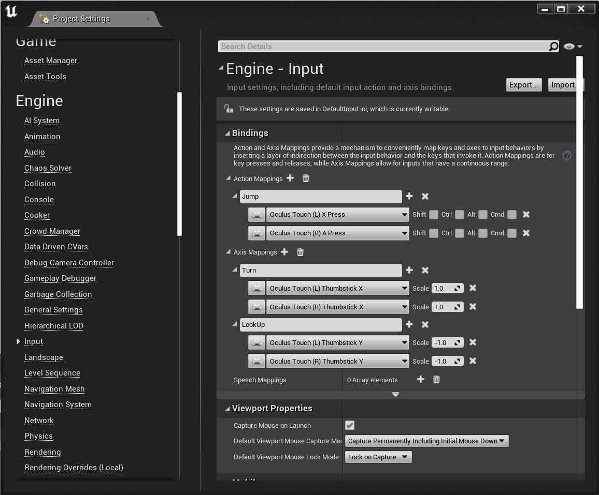

Before you try the C++ Hello World, I recommend this introduction [video](https://www.youtube.com/watch?v=p5Rp500kbOc) for knowing what C++ Programming is in the Unreal Engine.
## C++ Hello World
* Checkout this GitHub [repo](https://github.com/xg590/UE4_helloWorld) so you can play it before learn.
### A Minimalistic Game with Unreal Engine 4.27
1. Create a blank C++ Game project (name it as "helloWorld") with no Starter Content.
</img>
2. We get an empty world (called "map or level" in UE) with floor and player start.
</img> 
3. Preview the world right now.
4. Create a new C++ class called "MyCharacter" which inherits the "Character" Class.
5. Edit MyCharacter.h and MyCharacter.cpp (My Project name is "helloWorld" be careful about HELLOWORLD_API) 

* MyCharacter.h 
```cpp
#pragma once

#include "CoreMinimal.h"
#include "GameFramework/Character.h"
#include "MyCharacter.generated.h"

class UInputComponent;
class UCameraComponent;

UCLASS()
class HELLOWORLD_API AMyCharacter : public ACharacter
{
	GENERATED_BODY()
	UPROPERTY(VisibleAnywhere) UCameraComponent* Camera;

public:
	AMyCharacter();

protected:
	virtual void BeginPlay() override;

public:
	virtual void SetupPlayerInputComponent(class UInputComponent* PlayerInputComponent) override;
};
```
* MyCharacter.cpp 
```cpp
#include "Camera/CameraComponent.h"
#include "MyCharacter.h"
#include "Components/CapsuleComponent.h"
#include "Components/InputComponent.h" 

AMyCharacter::AMyCharacter()
{
	this->bUseControllerRotationPitch = true;
	this->bUseControllerRotationYaw = true;
	this->AutoPossessPlayer = EAutoReceiveInput::Player0;
	this->AutoReceiveInput = EAutoReceiveInput::Player0; 
	Camera = CreateDefaultSubobject<UCameraComponent>(TEXT("FirstPersonCamera"));
	Camera->SetupAttachment(GetCapsuleComponent());
	Camera->bUsePawnControlRotation = false;
}

void AMyCharacter::BeginPlay()
{
	Super::BeginPlay();
}

void AMyCharacter::SetupPlayerInputComponent(UInputComponent* PlayerInputComponent)
{
	Super::SetupPlayerInputComponent(PlayerInputComponent);
	PlayerInputComponent->BindAction("Jump", IE_Pressed, this, &ACharacter::Jump); 
	PlayerInputComponent->BindAxis("Turn", this, &APawn::AddControllerYawInput);
	PlayerInputComponent->BindAxis("LookUp", this, &APawn::AddControllerPitchInput);
}
```
5. Delete the player start then add MyCharacter to the floor.
</img>  
6. In project settings->Engine->Input, add action mapping and axis mapping (Oculus Touch).
I am using Oculus Quest 2 but you may use things like Xbox Controller.
</img>  
7. Now you can jump and move view.

### Troubleshooting 
* Want to delete a C++ class

   2.1 Close UE and VS
   
   2.2 Delete foo.h and foo.cpp in the src folder and delete the binary folder

   2.3 Reopen UE and the project will rebuild